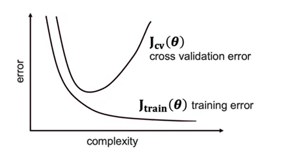

# Cross Validation

Cross-validation calculates errors across multiple train test splits, which is better than calculating errors on just one single fest split.

This covers you so that you don't have to worry about just getting a model correct by luck, but that model is able to perform well for any given holdout set.

Error matrix related to the complexity when determining the model:



Now, when you do cross-validation and you have each one of your holdout or validation sets, the idea will be that you will be able to decrease error up to a certain point by making it more complex, but as you get more and more complex, there will be an inflection point where you'll start to be over-fitting to your data and it won't generalize well to new data. So models associated with the left side of this curve before we hit the plateau are considered to be under-fitting, so they are not complex enough. Models associated with the right side of this curve are going to be considered over-fitting the data.

> 💡 Our goal is to get this just the right point where both the cross-validation error and training error is relatively low.

## Cross-Validation Approaches

### K-fold Cross-validation:

In this method, we split the data-set into k number of subsets(known as folds) then we perform training on the all the subsets but leave one(k-1) subset for the evaluation of the trained model.

### Leave One Out Cross Validation:

That's going to be similar to k-fold, just this time k is going to be equal to the number of rows minus 1, where we're going to leave one out for every single train test, split just a single row, and train on the remaining rows. So the plus of these is that we'll get many more test sets, many more evaluations of the test set so that we can be more certain about how well we're able to actually predict new incoming data. But it'll take a lot longer to actually train our data as we have to train across the number of rows that there are.

### Stratified Cross-Validation:

K-fold Cross-validation with representative samples

- What do you mean by representative sample?
    
    If we are working with a categorical outcome variable such as true or false and there was 80 percent true and 20 percent false on our original dataset, we want to ensure that when we do our train and test splits that our train and test splits also have a breakdown of 80 percent true, 20 percent false.

## Cross-validation: The Syntax

- Import the cross-validation function

```
from sklearn.model_selection import cross_val_score
```

- Other methods for cross-validation

```
from sklearn.model_selection import KFold, StratifiedKFold
```

- Perform cross-validation with a given model

```
cross_val = cross_val_score(model, X_data, y_data, cv=4, scoring='neg_mean_squared_error')
```

Here, cv is the number of splits

We're going to want to maximize whatever that scoring value is. So obviously, we want to minimize mean squared error. So we have to use negative mean squared error and it'll maximize the negative mean squared error, which means we are minimizing mean squared error.