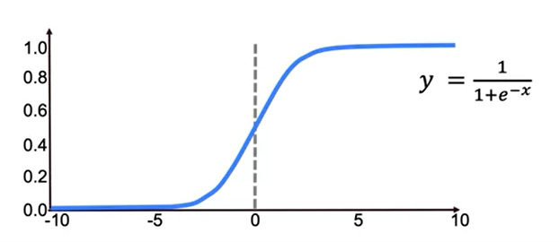

# Logistic Regression

Logistic Regression is a Machine Learning method that is used to solve classification issues where the outcome is a category.
It is used to predict the likelihood of a categorical dependent variable. The dependant variable in logistic regression is a binary variable with data coded as 1 (yes, True, normal, success, etc.) or 0 (no, False, abnormal, failure, etc.).

A Logistic Regression model is similar to a Linear Regression model, except that the Logistic Regression utilizes a more sophisticated cost function, which is known as the “Sigmoid function” or “logistic function” instead of a linear function.

### Sigmoid Function



The resulting algorithm that we have here is  called logistic regression and take on values between 0 and 1.

## Logistic Regression: The Syntax

```python
#Importing the class containing the classification method
from sklearn.linear_model import LogisticRegression

#Creating an instance of the class
LR = LogisticRegression(penalty='12', c=10.0) #Regularization Parameters

#Fitting the instance on the data and then predict the expected value
LR = LR.fit(X_train, y_train)
y_predict = LR.predict(X_test)

#View Coefficient
LR.coef_

#Tune regularization parameters with cross-validation
LogisticRegressionCV
```