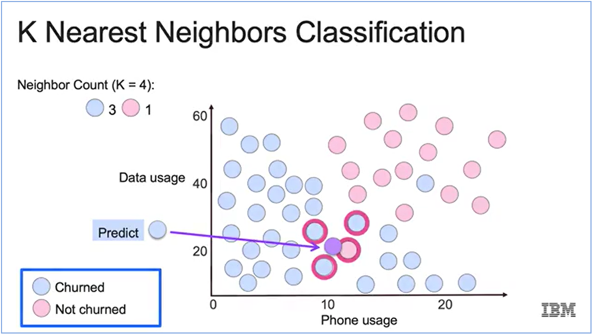

# K-Nearest Neighbors

K-Nearest Neighbor is one of the simplest Machine Learning algorithms based on the Supervised Learning technique. It assumes the similarity between the new case/data and available cases and put the new case into the category that is most similar to the available categories.



K-NN algorithm can be used for Regression as well as for Classification but mostly it is used for Classification problems.

To get started with K-NN Model:

- The first thing we need is to correctly determine the value of K i.e., how many neighbors we’re going to choose between.
- The second thing we need is to measure the distance between each one of our neighbors.

KNN does not provide a correct K for us. This will not be a learned parameter, but rather, it's going to be a hyperparameter, that we as users will have to tune in a similar fashion to how we have tuned things such as regularization terms, lambda, and C in our past models.

## KNN - The Syntax

```python
# import the class containing the classification methods
from sklearn.neighbors import KNeighborsClassifier

# create the instance of the class
KNN = KNeighborsClassifier(n_neighbors=3)

# fit the instance on the data and then predict the expected value 
KNN = KNN.fit(X_train, y_train)
y_predict = KNN.predict(X_test)
```

<aside>
💡 If you're interested in doing the same thing for **regression**, all you have to do is replace `KNeighborsClassifier` with `KNeighborsRegressor`, and ensure that your `Y_train` set and your `Y_test` set are both going to be continuous values, and everything else stays the same.

</aside>
