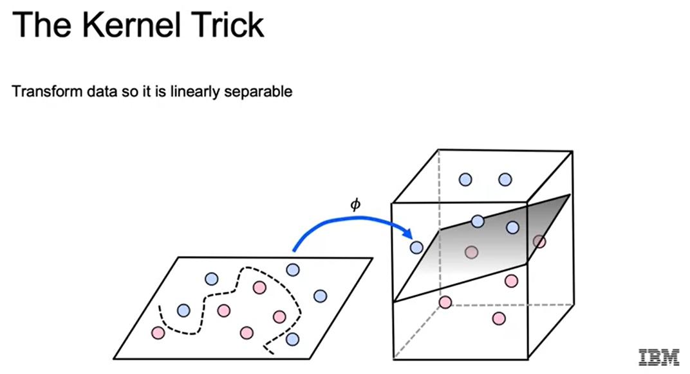

# Support Vector Machine 🤖

Support Vector Machine is a supervised machine learning algorithm that can be used for both classification and regression. It is a linear classifier. With support vector machine, the main idea is to find that line, or in a higher dimension that hyperplane that separates classes by determining decision boundaries that maximize the distance between classes.

A support vector machine doesn’t return probabilities, but rather returns labels of either one or zero.

**How it is different from Logistic Regression?** 🤔

When comparing logistic regression and SVMs, one of the main differences is that the cost function for logistic regression has a cost function that decreases to zero but rarely reaches zero. SVMs use the Hinge Loss function as a cost function to penalize misclassification. This tends to lead to better accuracy at the cost of having less sensitivity to the predicted probabilities.

### Linear SVM: The Syntax 💡

```python
# import the class containing the classification model
from sklearn.svm import LinearSVC

# create an instance of the class
LinSVC = LinearSVC(penalty='l2', c=10.0)

# fit the instance on data then predict the expected value
LinSVC = LinSVC.fit(X_train, y_train)
y_predict = LinSVC.predict(X_test)
```

> 💡 In order to perform regression, we can import `LinearSVM`

## SVMs with Kernel 🌽
The kernel trick can be used to achieve non-linear decision boundaries using support vector machines.



We'll essentially map our original data to higher dimensions with the knowledge that as we increase dimensions, we should be able to eventually find some linear decision boundary. That’s the main idea behind how we come up with a non-linear classification, built off a linear classifier such as a support vector machine.

### SVMs with Kernels: The Syntax 💡

```python
# import the class containing the classification model
from sklearn.svm import SVC

# create an instance of the class
rbfSVC = SVC(kernel='rbf', gamma=1.0, c=10.0)

# fit the instance on data then predict the expected value
rbfSVC = rbfSVC.fit(X_train, y_train)
y_predict = rbfSVC.predict(X_test)
```

### Kernel Approximation 〰️

The concept of mapping up to higher dimensions and then finding that linear separation is great conceptually, but in real life, it may not scale very well. Support vector machines with RBF kernels are very slow to train when we have a lot of data. So what we can do is use the kernel map to actually create a dataset in higher dimensional space using methods such as **Nystroem** and **RBF sampler**.

**Nystroem: The Syntax 💡** 

```python
# import the class containing the classification model
from sklearn.kernel_approximation import Nystroem

# create an instance of the class
NystroemSVC = Nystroem(kernel='rbf', gamma=1.0, n_components=100) # n_components is number of samples

# fit the instance on data and transform
X_train = NystroemSVC.fit_transform(X_train)
X_test = NystroemSVC.transform(X_test)
```

**RBFsampler: The Syntax 💡**

```python
# import the class containing the classification model
from sklearn.kernel_approximation import RBFsampler

# create an instance of the class
rbfSampler = RBFsampler(gamma=1.0, n_components=100) # RBF is the only kernel that can be use

# fit the instance on data and transform
X_train = rbfSampler.fit_transform(X_train)
X_test = rbfSampler.transform(X_test)
```

You can look at the documentation to see what other [kernel approximations](https://scikit-learn.org/stable/modules/classes.html#module-sklearn.kernel_approximation) that are available to us.

**When we would use that kernel approximation versus the regular SVC with the kernel?** 🤔

